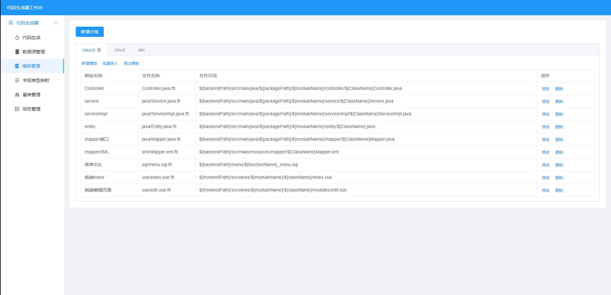

## 项目说明
- xlauch-codegen是一款低代码生成器，基于maku-generator 进行改造，可根据自定义模板内容，快速生成代码，可实现项目的快速开发、上线，减少重复的代码编写，开发人员只需专注业务逻辑即可。

- 增加了模板分组、在线模板修改等功能

- 增加了项目管理，可以配置快速切换项目，方便多个项目开发代码生成 

  


## 项目特点
- 友好的代码结构及注释，便于阅读及二次开发
- 支持spring boot starter，能很方便集成到第三方项目
- 支持通过配置数据源，快速生成CRUD代码，减少重复工作
- 支持MySQL、Oracle、SQLServer、PostgreSQL、达梦8等主流的数据库
- 支持第三方Java项目包名修改，修改包名变得简单快速
- 支持批量导入表、批量生成代码以及同步表结构等功能

## 本地启动
- 通过git下载源码
- 创建数据库xlauch-codegener，数据库编码为utf8mb4
- 执行db/xlauch-codegener.sql文件，初始化数据
- 修改application.yml，更新MySQL账号和密码、数据库名称
- 运行GeneratorApplication.java，则可启动项目
- 项目访问路径：http://localhost:8088/xlauch-codegen/index.html

## 二开说明
- 进入前端项目xlauch-codegen-ui，执行pnpm install
- 根据实际情况修改代码，执行build命令 
- 把dist目录的内容拷贝到xlauch-codegen-core的静态目录，覆盖原有文件


## maven依赖引入
```xml
<dependency>
    <groupId>com.xlauch</groupId>
    <artifactId>xlauch-codegen-boot-starter</artifactId>
    <version>1.0.2</version>
</dependency>
```

## 交流和反馈 
- Gitee仓库：https://gitee.com/makunet/maku-generator
- Github仓库：https://github.com/abciop/xlauch-codegen

 

## 支持
如果觉得框架还不错，或者已经在使用了，希望你可以去 [Github](https://github.com/abciop/xlauch-codegen) 或 [Gitee](https://gitee.com/makunet/maku-generator) 帮作者点个 ⭐ Star，这将是对作者极大的鼓励与支持。


## 效果图

* 代码生成


* 数据源管理


* 模板管理




* 字段类型映射


* 基类管理


* 项目管理


